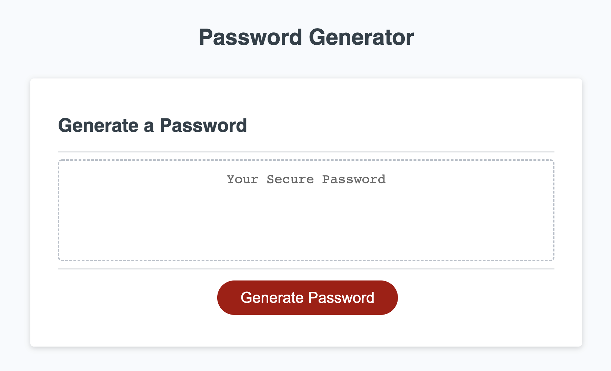

# Module 3 Challenge

## JavaScript Challenge: Password Generator

This week's challenge required us to create an application that someone can use to generate a random password based on criteria they've selected. The application runs in the browser. It allows the user to choose a password with a length of 8-128 characters. It also allows the user to generate a password with a choice of including uppercase, lowercase, numeric, and symbolic characters. It asks the user for these selections via window prompts, and then it displays the password in a text box.

We were assigned the following User Story:

```
AS AN employee with access to sensitive data
I WANT to randomly generate a password that meets certain criteria
SO THAT I can create a strong password that provides greater security
```

Below is the Acceptance Criteria:

```
GIVEN I need a new, secure password
WHEN I click the button to generate a password
THEN I am presented with a series of prompts for password criteria
WHEN prompted for password criteria
THEN I select which criteria to include in the password
WHEN prompted for the length of the password
THEN I choose a length of at least 8 characters and no more than 128 characters
WHEN asked for character types to include in the password
THEN I confirm whether or not to include lowercase, uppercase, numeric, and/or special characters
WHEN I answer each prompt
THEN my input should be validated and at least one character type should be selected
WHEN all prompts are answered
THEN a password is generated that matches the selected criteria
WHEN the password is generated
THEN the password is either displayed in an alert or written to the page
```

Link to the Website:
https://jpbigley.github.io/password-generator/

Image of the Website:

